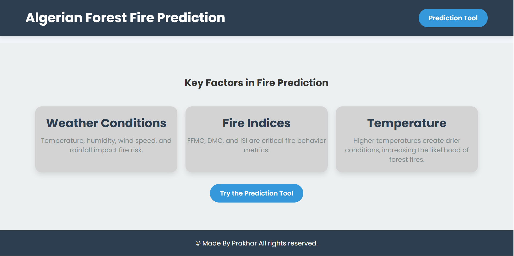
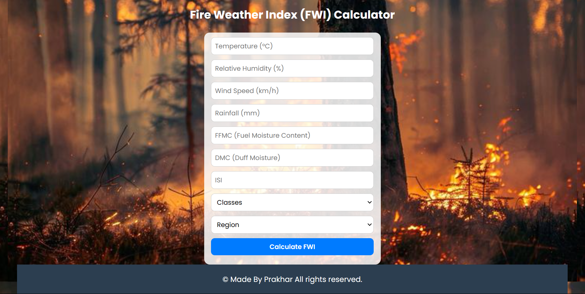
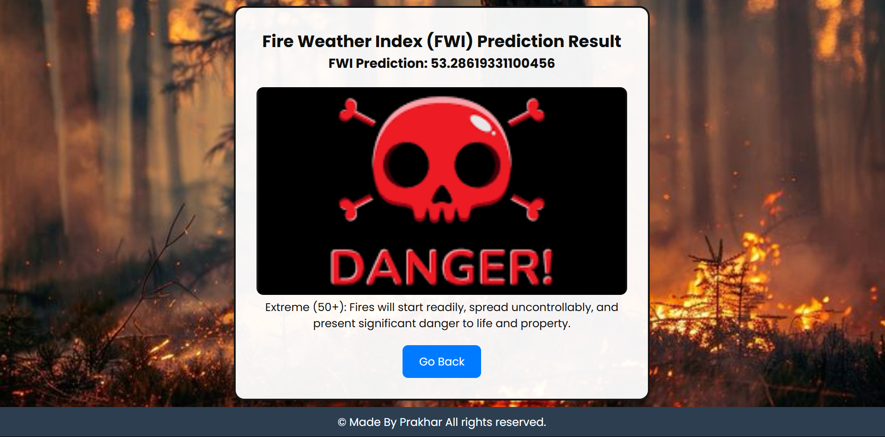

# Algerian Forest Fire Prediction

This project predicts the **Fire Weather Index (FWI)** for two regions in Algeria: **Sidi-Bel** and **Brjaia**. The FWI is a crucial indicator used to estimate the likelihood of forest fires based on environmental parameters. The model has been developed using **Machine Learning (ML)** algorithms to assist in early fire detection and risk management.

## Table of Contents
- [Overview](#overview)
- [Features](#features)
- [Dataset](#dataset)
- [Model](#model)
- [Tech Stack](#tech-stack)
- [Usage](#usage)
- [Screenshots](#screenshots)
- [Future Enhancements](#future-enhancements)
- [Contributing](#contributing)
- [License](#license)

## Overview
The project provides a web-based interface where users can input various environmental factors such as temperature, humidity, wind speed, and rainfall to predict the Fire Weather Index. Based on the FWI value, the risk level of a forest fire is categorized from **Low** to **Extreme**.

## Features
- Predicts Fire Weather Index (FWI) using ML.
- Supports prediction for two regions: **Sidi-Bel** and **Brjaia**.
- Provides visual indicators for fire risk levels.
- User-friendly web interface for input and result display.

## Dataset
The dataset used in this project contains historical environmental data including:
- Temperature (°C)
- Relative Humidity (%)
- Wind Speed (km/h)
- Rainfall (mm)
- Fine Fuel Moisture Code (FFMC)
- Duff Moisture Code (DMC)
- Initial Spread Index (ISI)
- Region Classification (0: Brjaia, 1: Sidi-Bel)

## Model
The machine learning model has been trained using algorithms like:
- **Linear Regression**
- **Ridge Regression**
- **Lasso Regression**
- **Elastic-Net**

The final model was selected based on evaluation metrics like **Mean Squared Error (MSE)** and **R-Squared Score**.

## Tech Stack
- **Frontend:** HTML, CSS, JavaScript
- **Backend:** Flask
- **Machine Learning:** Python, NumPy, Pandas, Scikit-Learn
- **Deployment:** Flask Web App

## Usage
- Enter the environmental parameters in the input form.
- Select the region (**Sidi-Bel** or **Brjaia**).
- Click on **Calculate FWI**.
- The model will display the predicted FWI and the corresponding risk level.

## Screenshots
- This is the Index page of the form

- This is how the form looks like 

- This is the result page

## Future Enhancements
- Integrate real-time weather data using external APIs.
- Implement additional regions.
- Deploy the application using Docker.

## Contributing
Contributions are welcome! Feel free to open issues or submit pull requests.

## License
This project is licensed under the [MIT License](LICENSE).

